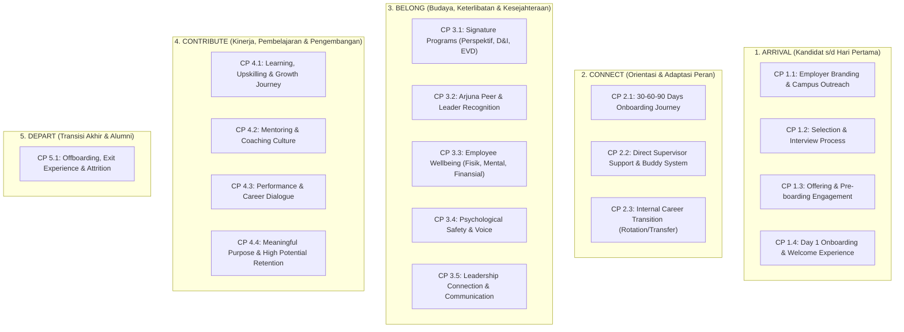

# 01. People Experience Brains & Mathematical Model
**CIMB Niaga People Experience (PX) Framework**

---

## 🧠 1. Filosofi & Fondasi Konseptual

Pengalaman Karyawan (*People Experience / PX*) di PT Bank CIMB Niaga Tbk dibangun berdasarkan visi *"Kejar Mimpi"*, yang menempatkan karyawan sebagai aset utama yang menjalani perjalanan holistik sepanjang masa baktinya di bank.

Sistem People Experience dirancang sebagai **"Measurement & Action Engine"** yang tidak hanya menghitung skor kepuasan secara pasif, melainkan menghubungkan persepsi karyawan (*Survey Sentiment*) dengan data transaksional operasional (*HR Outcomes*) untuk menghasilkan rekomendasi inisiatif perbaikan secara otomatis.

```
       ┌────────────────────────────────────────────────────────┐
       │             CIMB NIAGA PEOPLE EXPERIENCE               │
       │                   INTEGRATED INDEX                     │
       └───────────────────────────┬────────────────────────────┘
                                   │
                  ┌────────────────┴────────────────┐
                  ▼                                 ▼
       ┌─────────────────────┐           ┌─────────────────────┐
       │   SURVEY INDEX      │           │    OUTCOME INDEX    │
       │     Bobot: 70%      │           │     Bobot: 30%      │
       │  (Persepsi & Rasa)  │           │   (Data Fakta HR)   │
       └──────────┬──────────┘           └──────────┬──────────┘
                  │                                 │
                  └────────────────┬────────────────┘
                                   │
                                   ▼
        ┌──────────────────────────────────────────────────────┐
        │                 5 EMPLOYEE JOURNEYS                  │
        │      Arrival • Connect • Belong • Contribute • Depart│
        └──────────────────────────────────────────────────────┘
```

---

## 🗺️ 2. Arsitektur 5 Employee Journeys & 17 Checkpoints

Framework ini memetakan seluruh siklus kerja karyawan ke dalam **5 Tahapan Utama (Journeys)**, yang dipecah menjadi **17 Titik Sentuh Kritis (Checkpoints)** dan diukur melalui **27 Metrik Terstandarisasi**:



---

## 📐 3. Formula Matematika & Model Komputasi

### 3.1 Formula Utama: Konsolidasi PE Index Nasional

Indeks People Experience CIMB Niaga dikalkulasi menggunakan prinsip pembobotan gabungan antara instrumen kualitatif (*Survey*) dan fakta transaksional internal (*Outcome*):

$$\mathbf{PE\ Index} = \left( W_{\text{survey}} \times \mathbf{Index}_{\text{survey}} \right) + \left( W_{\text{outcome}} \times \mathbf{Index}_{\text{outcome}} \right)$$

Dimana secara default:
$$W_{\text{survey}} = 0.70 \quad (70\%), \qquad W_{\text{outcome}} = 0.30 \quad (30\%)$$

$$PE\ Index = 0.70 \times Index_{\text{survey}} + 0.30 \times Index_{\text{outcome}}$$

---

### 3.2 Normalisasi Skor Level Pertanyaan (4 Tipe Pertanyaan)

Sistem mendukung 4 tipe input pertanyaan pada kuesioner survei. Setiap tipe dinormalisasi ke skala seragam **$0.0\% - 100.0\%$**:

#### 1. Skala 1 s/d 5 (`SCALE_1_5`)
Rating likert 5 skala.
$$\text{Normalized Score}_i = \left( \frac{V_i}{5.0} \right) \times 100\%$$
*Contoh*: Nilai $4.85 \rightarrow \left(\frac{4.85}{5}\right) \times 100 = 97.0\%$.

#### 2. Skala 1 s/d 10 (`SCALE_1_10`)
Rating kepuasan 10 poin (NPS / CSAT).
$$\text{Normalized Score}_i = \left( \frac{V_i}{10.0} \right) \times 100\%$$
*Contoh*: Nilai $8.50 \rightarrow \left(\frac{8.50}{10}\right) \times 100 = 85.0\%$.

#### 3. Biner Ya / Tidak (`YES_NO`)
Jawaban biner berbasis kepatuhan/keberadaan fasilitas.
$$\text{Score}(V_i) = \begin{cases} 100\%, & \text{jika } V_i \in \{\text{'Ya'}, \text{'Y'}, \text{'True'}, \text{'1'}\} \\ 0\%, & \text{jika } V_i \in \{\text{'Tidak'}, \text{'T'}, \text{'False'}, \text{'0'}\} \end{cases}$$
Persentase ketercapaian butir soal $k$ dari $N$ responden:
$$\% \text{Ya}_k = \left( \frac{N_{\text{Ya}}}{N_{\text{Ya}} + N_{\text{Tidak}}} \right) \times 100\%$$

#### 4. Free Text / Kualitatif (`FREE_TEXT`)
Komentar dan saran teks bebas.
- **Sifat Komputasi**: *Non-scorable* (dikecualikan dari penyebut nilai rerata numerik responden agar tidak mendistorsi bobot matematis).
- **Output**: Disimpan sebagai feed verbatim kualitatif untuk analisis sentimen dan referensi AI Action Library.

---

### 3.3 Agregasi Skor Responden Individual

Untuk seorang koresponden $r$ yang mengisi instrumen dengan $K$ butir pertanyaan yang bernilai numerik/scorable ($K_{\text{scorable}} \subseteq K$):

$$\text{Respondent Score}_r = \frac{1}{|K_{\text{scorable}}|} \sum_{k \in K_{\text{scorable}}} \text{Normalized Score}_{r, k}$$

---

### 3.4 Agregasi Skor Metrik ($M_m$)

Skor agregat metrik $m$ diperoleh dari rerata seluruh respon valid yang masuk dalam periode berjalan:

$$\mathbf{Metric\ Normalized\ Score}_m = \frac{1}{N_m} \sum_{r=1}^{N_m} \text{Respondent Score}_r$$

Untuk metrik tipe **Outcome** yang berbasis data persentase langsung (misal: % SLA Fulfilment, % Early Attrition):
$$\mathbf{Metric\ Normalized\ Score}_m = \text{Achieved Percentage} \ (\%)$$

---

### 3.5 Agregasi Skor Checkpoint ($CP_c$)

Setiap checkpoint $c$ menaungi $M_c$ metrik:

$$\mathbf{Checkpoint\ Score}_c = \frac{1}{M_c} \sum_{m=1}^{M_c} \mathbf{Metric\ Normalized\ Score}_m$$

---

### 3.6 Agregasi Skor Journey ($J_j$)

Skor suatu Journey $j$ diperoleh dari rata-rata terbobot atau rata-rata sederhana dari seluruh metrik di dalamnya:

$$\mathbf{Journey\ Score}_j = \sum_{m \in J_j} \left( w_m \times \mathbf{Metric\ Normalized\ Score}_m \right)$$

Dimana $\sum_{m \in J_j} w_m = 1.0$ (secara default bobot terdistribusi merata / *equal weights* antar metrik dalam journey tersebut, kecuali disesuaikan oleh Admin pada menu Bobot Journey).

---

### 3.7 Agregasi Indeks Survei & Indeks Outcome

$$\mathbf{Index}_{\text{survey}} = \frac{1}{|M_{\text{survey}}|} \sum_{m \in M_{\text{survey}}} \mathbf{Metric\ Normalized\ Score}_m$$

$$\mathbf{Index}_{\text{outcome}} = \frac{1}{|M_{\text{outcome}}|} \sum_{m \in M_{\text{outcome}}} \mathbf{Metric\ Normalized\ Score}_m$$

Dimana:
- $|M_{\text{survey}}| = 20$ metrik.
- $|M_{\text{outcome}}| = 7$ metrik.

---

### 3.8 Model Agregasi Skor Butir Pertanyaan ESS (Employee Sentiment Survey)

Untuk 11 metrik survei yang bersumber dari **ESS (Employee Sentiment Survey)**, skor metrik dihitung dari rata-rata persentase respon positif (*% Favorable*) butir-butir pertanyaan dalam dimensi terkait:

$$\mathbf{ESS\ Dimension\ Score}_d = \frac{1}{|Q_d|} \sum_{q \in Q_d} \text{\% Favorable}_q$$

$$\mathbf{Metric\ Normalized\ Score}_{m \in \text{ESS}} = \mathbf{ESS\ Dimension\ Score}_{d(m)}$$

Dimana:
- $Q_d$ adalah himpunan pertanyaan berbobot dalam dimensi $d$.
- $\text{\% Favorable}_q + \text{\% Neutral}_q + \text{\% Unfavorable}_q = 100\%$.
- Setiap pertanyaan memiliki metadata aturan keterlihatan (*visible based on*) dan kewajiban pengisian (*required based on*).

---

## ⏳ 4. Model Agregasi Waktu: Period Filter (YTD vs Bulanan)

Sistem menerapkan dua mode komputasi temporal:

1. **Year-to-Date (YTD) - Default Global**:
   - Menghitung seluruh data transaksi dan respon survei yang tercatat mulai dari awal tahun berjalan (misal: 1 Januari 2026) hingga tanggal terkini (*running year cumulative*).
   - Memberikan gambaran performa makro jangka panjang bank.

2. **Monthly Period (Bulanan - YYYY-MM)**:
   - Memfilter himpunan data $D_{\text{filter}} = \{d \in D \mid \text{Format}(d.\text{date}, \text{'YYYY-MM'}) = \text{SelectedMonth}\}$.
   - Menghasilkan indeks murni untuk bulan tersebut (misal: `2026-03` untuk Maret 2026).
   - Memungkinkan analisis komparasi *Month-over-Month (MoM)*.

3. **12-Month Progression Trend Engine**:
   - Mengeksekusi komputasi $PE(t)$ untuk setiap $t \in [1..12]$ menghasilkan time series:
     $$\mathbf{Trend} = \big[ (PE_{\text{Jan}}, S_{\text{Jan}}, O_{\text{Jan}}), (PE_{\text{Feb}}, S_{\text{Feb}}, O_{\text{Feb}}), \dots, (PE_{\text{Des}}, S_{\text{Des}}, O_{\text{Des}}) \big]$$

---

## 🚨 5. Alert & Deficit Detection Engine

Sistem mengimplementasikan deteksi anomali kinerja secara real-time untuk setiap metrik $m$:

```
      Normalized Score (%)
               │
      100% ────┼───────────────────────────
               │  🟢 EXCELLENT / ON TARGET
       80% ────┼─────────────────────────── [Target Batas Aman: >= 80%]
               │  🟡 WARNING / WATCHLIST
       75% ────┼─────────────────────────── [Ambang Toleransi / Min Threshold: 75%]
               │  🔴 CRITICAL DEFICIT
        0% ────┴───────────────────────────
```

### Logika Klasifikasi Status:
1. **On Target (Hijau)**: $\text{Normalized Score}_m \ge \text{Target Value}$ (Default $\ge 80.0\%$).
2. **Warning / Needs Attention (Kuning)**: $\text{Min Threshold} \le \text{Normalized Score}_m < \text{Target Value}$ ($75.0\% \le \text{Score} < 80.0\%$).
3. **Critical Deficit (Merah)**: $\text{Normalized Score}_m < \text{Min Threshold}$ ($< 75.0\%$).
   - Memicu pembuatan entri pada **Pusat Peringatan & Defisit Kinerja PE** (`/api/alerts`).
   - Otomatis menghubungkan metrik yang defisit ke **Action Library** untuk memunculkan inisiatif perbaikan berbasis AI dan SOP internal CIMB Niaga.

---

## 🏛️ 6. Filter Direktorat & Eksklusi Dinamis Metrik Non-Karyawan (v2.9.0)

Ketika sistem difilter berdasarkan **Direktorat atau Sub-Direktorat** tertentu (bukan *All / Bankwide*), metrik non-karyawan dieksklusikan secara dinamis:

1. **Klasifikasi Metrik**:
   - **Internal Employee Metrics ($M_{\text{emp}}$)**: Metrik #6 s/d #27 (misal: Pre-boarding, Day 1 Onboarding, Onboarding 30/60/90, 11 Dimensi ESS, Training Attendance, Promotion Rate, Turnover Rate, Exit Survey).
   - **External / Non-Employee Metrics ($M_{\text{ext}}$)**: Metrik #1 s/d #5 (Career Website Traffic, Goes to Campus Evaluation, University Success Ratio, Channel Success Ratio, Candidate Experience Score).

2. **Formulasi Normalisasi Bobot Dinamis**:
   Untuk journey $j$ yang memiliki subset metrik aktif $M_{j, \text{active}} \subseteq M_j$ yang relevan dengan karyawan direktorat:
   $$w_{m, \text{normalized}} = \frac{w_m}{\sum_{k \in M_{j, \text{active}}} w_k}$$

   $$\mathbf{Journey\ Score}_j = \sum_{m \in M_{j, \text{active}}} \left( w_{m, \text{normalized}} \times \mathbf{Score}_m \right)$$

   Untuk metrik non-karyawan yang dinonaktifkan:
   - Diberi status `is_disabled = true` dan `disabled_reason = "Non-employee external metric excluded from directorate view"`.
   - Ditampilkan dengan warna abu-abu (*muted grey*) dan tidak dapat diklik (*unclickable*).
   - Seluruh metrik aktif dalam Journey 1 s/d 5 menggulung ke total **People Experience Index** dengan bobot 70% Survey dan 30% Outcome secara proporsional.

