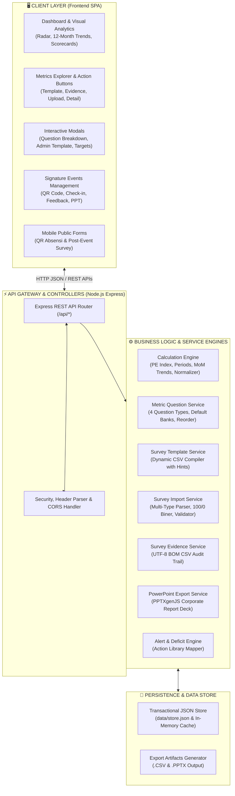
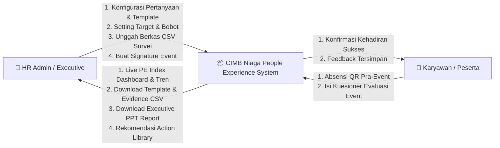

# 03. System Architecture & Data Flow
**CIMB Niaga People Experience (PE) Framework**

---

## 🏛️ 1. Arsitektur Sistem (High-Level Architecture)

Sistem People Experience CIMB Niaga dirancang dengan arsitektur **Modern Single-Page Application (SPA) terintegrasi dengan RESTful Micro-Services Backend** yang beroperasi secara mandiri (*standalone on-premise*) tanpa ketergantungan pada layanan cloud pihak ketiga:



---

## 🔄 2. Data Flow Diagram (DFD)

### 2.1 DFD Level 0: Context Diagram



---

### 2.2 DFD Level 1: Dekomposisi Proses Utama

```mermaid
flowchart TD
    subgraph P1["Proses 1.0: Real-time PE Calculation"]
        D1[("Database Store")] -->|Ambil Respon & Target| P1_Calc[Kalkulasi Normalisasi 70/30]
        P1_Calc -->|Period Filter: YTD / YYYY-MM| P1_Out[JSON Skor Konsolidasi, Radar & Tren]
    end

    subgraph P2["Proses 2.0: Dynamic CSV Template & Question Builder"]
        Admin_Req[Request Template Metrik] --> P2_Gen[Baca Konfigurasi 4 Tipe Pertanyaan]
        P2_Gen --> P2_Compile[Kompilasi Header & Sample Row]
        P2_Compile -->|Stream CSV| Admin_DL[Unduh File Template .csv]
    end

    subgraph P3["Proses 3.0: Survey CSV Bulk Import Engine"]
        Upload_File[File CSV Diunggah] --> P3_Parse[Parser Delimiter & Sanitizer]
        P3_Parse --> P3_Val[Validasi NIP, Metric ID & Tipe Jawaban]
        P3_Val -->|Valid| P3_Save[Simpan Respon ke Store & Kalkulasi Ulang]
        P3_Val -->|Invalid| P3_Err[Laporan Baris Gagal & Alasan Error]
    end

    subgraph P4["Proses 4.0: Event Management & PPT Generator"]
        Event_Form[Peserta Submit Rating Event] --> P4_Store[Catat Skor Evaluasi]
        P4_Store --> P4_PPT[PPTXgenJS Compile Slides & Charts]
        P4_PPT --> PPT_File[Unduh Executive Report .pptx]
    end
```



---

## 🔄 3. Siklus Hidup Data Survei (Survey Data Lifecycle)

```
   ┌──────────────────────┐
   │ 1. KONFIGURASI ADMIN │ ──> Admin menyusun butir soal & tipe jawaban di Admin Modal
   └──────────┬───────────┘
              │
              ▼
   ┌──────────────────────┐
   │ 2. GENERATE TEMPLATE │ ──> Sistem menghasilkan berkas CSV dengan header pertanyaan spesifik
   └──────────┬───────────┘
              │
              ▼
   ┌──────────────────────┐
   │ 3. PENGISIAN DATA    │ ──> HR mendistribusikan / mengisi CSV respon karyawan
   └──────────┬───────────┘
              │
              ▼
   ┌──────────────────────┐
   │ 4. VALIDASI & IMPORT │ ──> Parser memverifikasi NIP, normalisasi Ya/Tidak (100/0) & skala
   └──────────┬───────────┘
              │
              ▼
   ┌──────────────────────┐
   │ 5. REKALKULASI INDEX │ ──> PE Index, radar chart, skor journey, dan tren bulanan ter-update
   └──────────┬───────────┘
              │
              ▼
   ┌──────────────────────┐
   │ 6. AUDIT EVIDENCE    │ ──> Tim HR dapat mengekspor berkas audit CSV berstempel tanggal
   └──────────────────────┘
```

---

## 🔒 4. Keamanan, Kepatuhan On-Premise & Integritas Data

1. **Zero External Dependency (On-Premise Ready)**:
   - Seluruh backend berjalan di lingkungan intranet Bank tanpa memerlukan koneksi internet aktif atau layanan cloud SaaS.
2. **Validasi Karyawan Berbasis NIP**:
   - NIP diverifikasi pada setiap baris data survei maupun absensi event untuk memastikan tidak terjadi duplikasi respon dari karyawan yang sama dalam satu periode penilaian.
3. **Standar Berkas CSV UTF-8 BOM**:
   - Berkas CSV ekspor (baik template maupun evidence) menggunakan encoding UTF-8 dengan Byte Order Mark (`\uFEFF`) guna memastikan kompatibilitas sempurna saat dibuka di Microsoft Excel versi desktop perbankan tanpa merusak karakter khusus atau format kolom.
4. **Resiliency & Fallback Column Matching**:
   - Parser impor survei dilengkapi algoritma *fuzzy header matching* yang tetap mengenali kolom pertanyaan baik berdasarkan nama *key* unik (`q1_recruitment_process`) maupun urutan nomor urut (`q1`, `q2`, `q3`, dst.).
5. **Sub Agent "Auditor" — Audit Data Dummy/Hardcode (`.claude/agents/auditor.md`)**:
   - Persona *read-only* untuk memeriksa codebase secara berkala dan mendeteksi nilai yang dibekukan (hardcoded) dalam logika bisnis (`server/services/*.js`) yang seharusnya bersumber dari database (`server/db/storage.js` / `store.json`), parameter admin yang dapat diedit, atau jam server real-time — dibedakan secara eksplisit dari `server/db/seedData.js` yang memang sengaja berisi data seed/demo statis (bukan bug). Jalankan lewat Agent tool dengan membaca instruksi di `.claude/agents/auditor.md` sebagai brief. Temuan pertama (2026-09-18, lihat `CHANGELOG.md` **[2.12.0]**): peta tanggal ingestion Outcome yang hardcoded di kode dipindah menjadi field database `last_data_date`, tahun `'2026'` yang dibekukan di banyak tempat diganti turunan jam server, dan agregasi verbatim alert yang hanya mengambil dari 1 event ID hardcoded diperluas ke seluruh event di database.
