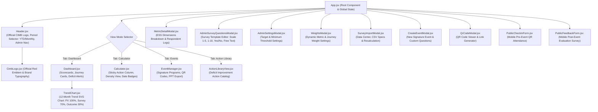

# 05. Frontend UI & Component Hierarchy
**CIMB Niaga People Experience (PX) Framework**

---

## 🎨 1. Arsitektur Frontend & Tech Stack

Antarmuka pengguna People Experience dibangun menggunakan ekosistem **React 19, Vite, Tailwind CSS v4, dan Lucide React** dengan antarmuka 100% berbahasa Inggris (*Full English Localization*) untuk menghadirkan performa rendering kilat, responsivitas tinggi, serta estetika korporat modern khas perbankan (*CIMB Corporate Identity & Official Emblem*).

```
📁 src/
├── 📄 main.jsx                              # Mount Point React DOM
├── 📄 App.jsx                               # Root Component, State Global & Navigation
├── 📄 index.css                             # Tailwind Directives & Custom Corporate Theme
└── 📁 components/                           # Komponen Antarmuka Terisolasi (100% English UI)
    ├── 📄 CimbLogo.jsx                      # Official CIMB Niaga Corporate Emblem & Typography
    ├── 📄 Header.jsx                        # Top Navigation, Period Selector & Admin Action Toolbar
    ├── 📄 Dashboard.jsx                     # Executive Scorecards, Journey Cards & Deficit Interventions
    ├── 📄 TrendChart.jsx                    # Interactive 12-Month Performance Trend Chart (SVG)
    ├── 📄 Calculator.jsx                    # Metrics Table, Freeze Sticky Actions, Scroll Controls
    ├── 📄 EventManager.jsx                  # Signature Programs Event Management, QR & PPT Generator
    ├── 📄 ActionLibraryView.jsx             # PX Action Library & Best Practice Interventions
    ├── 📄 MetricDetailModal.jsx             # Metric Drilldown, ESS Dimensions & Audit Log Modal
    ├── 📄 AdminSurveyQuestionsModal.jsx     # Admin Survey Questions & Multi-Type Questions Engine
    ├── 📄 AdminSettingsModal.jsx            # Admin Target & Minimum Threshold Settings Modal
    ├── 📄 WeightsModal.jsx                  # Dynamic Weights & Consolidation Settings Modal
    ├── 📄 SurveyImportModal.jsx             # Survey Data Center & Bulk CSV Drag-and-Drop
    ├── 📄 CreateEventModal.jsx              # Signature Event Creation & Custom Question Modal
    ├── 📄 QrCodeModal.jsx                   # QR Code Distribution & Sharing Modal
    ├── 📄 PublicCheckInForm.jsx             # Public Mobile QR Attendance Check-In Form
    ├── 📄 PublicFeedbackForm.jsx            # Public Mobile Post-Event Evaluation Survey Form
    └── 📄 ErrorBoundary.jsx                 # Crash Fallback & Reload Boundary Component
```

---

## 🌳 2. Pohon Hirarki Komponen (Component Tree)



---

## 🎛️ 3. Deskripsi & Fungsionalitas Komponen Utama

### 3.1 Root Orchestrator ([`src/App.jsx`](file:///d:/Mul/Project/Anti%20Gravity/People%20Experience/src/App.jsx))
- **State Management**:
  - `selectedPeriod`: Menyimpan filter periode aktif (`'YTD'`, `'2026-01'`, `'2026-02'`, dst.).
  - `activeTab`: Navigasi antar tampilan utama (*Dashboard, PX Index Calculator, Signature Programs, Action Library, Glossary*).
  - `selectedMetric`: Mengontrol metrik yang sedang dibuka pada *MetricDetailModal*.
  - `isSurveyQuestionsModalOpen`, `isSettingsModalOpen`, `isWeightsModalOpen`, `isImportModalOpen`: Mengontrol visibilitas modal admin dan impor data.
- **Data Fetching Reactive Hook**: Otomatis memicu pemanggilan ulang `/api/metrics/calculate?period=...` setiap kali filter periode berubah atau data baru berhasil diunggah.

---

### 3.2 Header & Kontrol Periode ([`src/components/Header.jsx`](file:///d:/Mul/Project/Anti%20Gravity/People%20Experience/src/components/Header.jsx))
- Menyajikan logo resmi CIMB Niaga via [`CimbLogo.jsx`](file:///d:/Mul/Project/Anti%20Gravity/People%20Experience/src/components/CimbLogo.jsx) dan identitas *"People Experience (PX)"*.
- **Dropdown Filter Periode**: Memilih secara instan antara tampilan akumulatif *Year-to-Date (YTD)* atau bulan berjalan (*Month-to-Date*). Dropdown **Tahun** kini diisi secara dinamis dari `available_years` pada response `/api/metrics/calculate` (bersumber dari `storage.getAvailableSurveyYears()` — tahun yang benar-benar punya data survei di database), bukan lagi daftar statis `['2026', '2025']` di kode frontend.
- **Tombol Aksi Cepat Admin**:
  - 📝 **Survey Templates**: Membuka *AdminSurveyQuestionsModal*.
  - 🎯 **Set Targets**: Membuka *AdminSettingsModal*.
  - ⚖️ **Adjust Weights**: Membuka *WeightsModal*.
  - 📤 **Bulk Survey CSV**: Membuka *SurveyImportModal*.

---

### 3.3 Executive Dashboard & Trend Performance ([`src/components/Dashboard.jsx`](file:///d:/Mul/Project/Anti%20Gravity/People%20Experience/src/components/Dashboard.jsx))
- **Executive Scorecards**:
  - Skor Konsolidasi **PX Index (100%)** beraksen Primary Red (`#ED1C24` / `#FF0000`) dengan indikator delta dan status pencapaian target.
  - Skor **Survey Index (70% Weight)** beraksen Digital Teal (`#16C0B7` / `#0D9488`).
  - Skor **Outcome Index (30% Weight)** beraksen Royal Blue (`#2563EB` / `text-blue-400`), terbedakan secara kontras tinggi dari warna merah PX Index.
  - Total Partisipasi Sampel Responden.
- **Grafik Tren Performa 12 Bulan ([`src/components/TrendChart.jsx`](file:///d:/Mul/Project/Anti%20Gravity/People%20Experience/src/components/TrendChart.jsx))**:
  - **Skala Penuh 0% – 100% (*Full Y-Axis Scale*)**: Memastikan semua data titik persentase dari 0% hingga 100% tampil utuh tanpa ada garis yang terpotong di bagian bawah.
  - **Diferensiasi Warna Garis**:
    - **PX Index (100%)**: Garis merah tebal 3.5px (`#ED1C24`).
    - **Survey Index (70%)**: Garis hijau toska (*Digital Teal*) 2.5px (`#16C0B7`).
    - **Outcome Index (30%)**: Garis biru royal (*Royal Blue*) 2.5px (`#2563EB`).
    - **Target Benchmark (85.0%)**: Garis putus-putus merah marun (*Deep Maroon*) 1.5px (`#780000`).
  - **Hanya Menampilkan Bulan yang Benar-Benar Lengkap**: Grafik **tidak lagi memuat bulan kalender yang sedang berjalan atau setelahnya sama sekali** (tidak sekadar diberi warna pudar seperti versi sebelumnya) — jika hari ini September 2026, array data hanya berisi 8 titik (Januari–Agustus), titik ke-9 (September) dst. tidak ada. Tahun mengikuti tahun berjalan (tidak lagi dibekukan ke 2026).
  - **Filter Rentang Periode — Bisa Lintas Tahun (Dari Tahun+Bulan / Sampai Tahun+Bulan)**: Dua pasang dropdown Tahun+Bulan (bukan cuma Bulan) di atas grafik untuk mempersempit tampilan ke rentang periode tertentu — termasuk rentang yang **melewati batas tahun**, mis. "November 2025 s/d Februari 2026". Default **Januari s/d bulan lengkap terakhir tahun berjalan**. Opsi Tahun diambil dari `available_years` (data sungguhan di database); opsi Bulan dibatasi otomatis hanya sampai bulan lengkap terakhir tahun yang dipilih — tidak mungkin memilih bulan yang belum selesai, di tahun manapun. Judul chart dan label sumbu-X (mis. "Nov '25") menyesuaikan otomatis saat rentang lintas tahun aktif. Tombol **"Reset"** muncul saat rentang diubah dari default.
  - **Mode YTD Reset per Tahun pada Rentang Lintas Tahun**: Saat rentang lintas tahun aktif dengan mode YTD, kurva kumulatif **reset tiap 1 Januari** (konvensi pelaporan YTD standar) — bukan satu akumulasi menerus lintas tahun.
  - **Fetch Mandiri**: `TrendChart.jsx` kini melakukan `fetch` sendiri ke `GET /api/metrics/trends` (menerima prop `trendMode`, `directorate`, `subDirectorate`, `year` dari Dashboard) setiap kali mode/direktorat/rentang berubah — tidak lagi bergantung pada `monthly_trends` yang disisipkan di response besar `/api/metrics/calculate`.
  - **Mengikuti Toggle YTD/MTD Dashboard**: Menampilkan badge + deskripsi yang berbeda — **"Cumulative YTD"** (progresi kumulatif rata-rata berjalan Januari s/d bulan tersebut) saat mode YTD aktif, atau **"Monthly Movement (MTD)"** (data tiap bulan berdiri sendiri, tanpa akumulasi) saat mode MTD aktif. Filter rentang periode berlaku untuk kedua mode.
  - **Konsisten dengan Scorecard PX Index**: Setiap titik bulan dihitung via `calculatePEIndex()` (metode normalisasi + bobot per-metrik yang sama dengan scorecard utama), sehingga nilainya **selalu sama** dengan angka scorecard "CIMB Niaga PX Index" untuk periode yang sama — memperbaiki bug sebelumnya di mana chart bisa menampilkan ~59% saat scorecard menunjukkan ~83% untuk periode yang sama (lihat `CHANGELOG.md` **[2.11.1]** dan **[2.13.0]**).
- **Journey Performance Cards**: Ringkasan capaian per tahapan employee journey (*Hire, Onboard, Work, Move, Exit*).
  - **Metrics List dengan Status Eksplisit (sejak v2.17.1)**: Setiap metrik dalam kartu Journey ditampilkan sebagai baris penuh bertumpuk (bukan lagi chip kecil yang di-wrap), diwarnai sesuai status pencapaian — **Hijau** (`bg-emerald-50` / `text-emerald-700`) untuk *On Target*, **Kuning** (`bg-amber-50` / `text-amber-700`) untuk *Warning*, dan **Merah** (`bg-red-50` / `text-red-700`) untuk *Critical*. Selain warna, setiap baris kini menampilkan **ikon status eksplisit** (`CheckCircle2`/`AlertTriangle`/`AlertCircle`/`MinusCircle` untuk metrik yang di-exempt) beserta **label teks status** ("ON TARGET"/"WARNING"/"CRITICAL"/"EXEMPTED") di sisi kanan — mengikuti pola badge status yang sama dengan Explore Metrics (`Calculator.jsx`). Nama metrik kini punya ruang horizontal penuh (baris lebar kartu, bukan lagi `max-w-[120px]` yang terpotong `...`). Nomor metrik ditampilkan tanpa awalan `#` dan dipisahkan dari nama metrik dengan tanda hubung (contoh: `1 - Career website & social media follower...` bukan `#1 Career website...`).
- **Deficit Action Alert Banner**: Notifikasi otomatis metrik yang berada di bawah ambang batas (*threshold*) beserta rekomendasi tindakan korektif.
  - **Ringkasan Analisis AI (Local Ollama)**: Setiap kartu alert menampilkan narasi 1 paragraf (`narrative_summary`) yang dihasilkan dinamis oleh model Ollama on-premise via `alertEngine.js`, ditampilkan di atas bagian *Recommended Immediate Action* dari Action Library. Fallback otomatis ke kalimat rule-based jika Ollama offline.

---

### 3.4 PX Index Calculator & Freeze Action Column ([`src/components/Calculator.jsx`](file:///d:/Mul/Project/Anti%20Gravity/People%20Experience/src/components/Calculator.jsx))
- **Freeze / Sticky Action Column**: Kolom *Actions & Docs* terfiksasi di sisi kanan (`sticky right-0`), sehingga pengguna dapat langsung mengklik tombol aksi tanpa perlu scroll horizontal ke dasar halaman.
- **Density View Switcher**: Pilihan mode tampilan *Fit Screen* vs *Wide View*.
- **Quick Scroll Navigator**: Tombol navigasi *Scroll Left* dan *Scroll Right* langsung pada toolbar tabel.
- **Outcome Ingestion Date Badge**: Menampilkan tanggal riil data masuk terakhir (`last_survey_date`, misal: `2026-03-24`) untuk seluruh metrik Survey maupun Outcome.
- **Kolom ID Metrik**: Menampilkan nomor urut metrik tanpa awalan `#` (contoh: `1`, `2`, dst.).
- **Pill Action Buttons** (kolom *Actions & Evidence*, seluruhnya beraksen **Slate** netral `bg-slate-100` / `text-slate-700` / `border-slate-200` / `hover:bg-slate-200` — dipilih *soft, corporate, dan elegant*, sengaja berbeda dari palet warna status Hijau/Kuning/Merah agar tidak tertukar makna dengan indikator On Target/Warning/Critical):
  - 📥 **Template**: Download CSV template spesifik metrik dengan butir pertanyaan kustom.
  - 📄 **Evidence**: Download CSV rekapitulasi data jawaban responden dan tanggal transaksi.
  - 📤 **Upload**: Modal impor cepat data jawaban CSV responden.
  - 🔍 **Detail**: Modal deep-dive butir soal, dimensi ESS, dan audit trail.
  - 🗄️ **View Data** / ⚙️ **Target** (metrik Outcome): Melihat data HR internal dan mengatur target/threshold.

---

### 3.5 Modal Rincian Metrik Multi-Tipe & ESS Spreadsheet Table ([`src/components/MetricDetailModal.jsx`](file:///d:/Mul/Project/Anti%20Gravity/People%20Experience/src/components/MetricDetailModal.jsx))
- **Excel Spreadsheet Table View (Khusus 11 Metrik ESS)**:
  - Format tabel laporan Excel resmi dengan header ungu (`#563175` / `#663A8B`):
    - Kolom *"Scored question"*: Dimension, Question, Question is visible based on, Question is required based on.
    - Kolom Metrik Sentimen: `% Favorable` (Hijau), `% Neutral` (Kuning/Abu-abu), `% Unfavorable` (Merah).
    - Baris agregasi total dimensi (*<Dimension> Total*) bercetak tebal (*bold summary*).
  - **View Mode Switcher**: Tombol toggle untuk berganti antara *Spreadsheet View* dan *Card View*.
- **Visualisasi Question Breakdown Multi-Tipe (Metrik Survei Reguler)**:
  - `SCALE_1_5` & `SCALE_1_10`: Menampilkan rata-rata skor numerik, skala dasar, dan persentase normalisasi.
  - `YES_NO`: Menampilkan persentase ketercapaian `% Ya`, counter jumlah *✓ Ya* vs *✕ Tidak*, dan progress bar visual.
  - `FREE_TEXT`: Menampilkan counter komentar dan kartu kutipan verbatim responden.
- **Sub-Menu List Koresponden & Isi Survei**: Tabel daftar koresponden, NIP, tanggal survei, pill rating per pertanyaan, dan drawer detail individual.
- **Tab Log Data HR Internal (Khusus Outcome)**: Menampilkan data absensi peserta atau matriks breakdown pencapaian per divisi.

---

### 3.6 Modal Admin Pengaturan Pertanyaan ([`src/components/AdminSurveyQuestionsModal.jsx`](file:///d:/Mul/Project/Anti%20Gravity/People%20Experience/src/components/AdminSurveyQuestionsModal.jsx))
- Panel visual bagi Admin untuk menambah, mengedit, memilih tipe jawaban (4 tipe), menyusun ulang urutan pertanyaan (*Move Up/Down*), mengunduh template aktif, dan melihat *Live CSV Header Preview*.

---

### 3.7 Modal Parameter Journey & Metric ([`src/components/AdminParametersModal.jsx`](file:///d:/Mul/Project/Anti%20Gravity/People%20Experience/src/components/AdminParametersModal.jsx))
- **Tab Parameter Metric**: Tabel CRUD lengkap (Nama, Journey, Tipe, Responden, Bobot, Target, Threshold) dengan kolom **Update Data** menampilkan badge frekuensi (*Bulanan*/*Tahunan*) dan nama PIC upload.
- **Kolom Target & Threshold dalam Satuan Sama (sejak v2.15.0)**: kolom "Target (%)" menampilkan `target_value_normalized` dari API (mis. **80.0%** untuk metrik RATING_5 bertarget 4.00/5) sebagai nilai utama, dengan bentuk asli (`target_display`, mis. "> 4.00/5") sebagai subteks kecil — langsung sebanding dengan kolom "Threshold (%)" di sebelahnya, tidak lagi mencampur skala mentah (1-5) dengan persen (0-100). Fallback klien `computeTargetPercent()` mereplikasi konversi backend `normalizeTarget()` jika field belum tersedia di response.
- **Update Data Berkala & Pengingat Upload Survei** (bagian form Tambah/Edit Metric): dropdown *Frekuensi Update Data*, toggle *"Survei ini masih diupload manual oleh PIC"* (khusus metrik Survey), input *Nama PIC*, *Email PIC*, dan *Batas Tanggal Upload* (tanggal, + bulan untuk metrik Tahunan). Input *Target Nilai* dan *Min Threshold* kini diberi label satuan eksplisit ("satuan skala asli — 1.0-5.0" vs "selalu dalam %, 0-100") plus hint hidup di bawah *Target Nilai* menunjukkan persentase ekivalennya secara real-time.
- **Panel Survey Upload Reminders**: Banner kuning otomatis muncul di atas tabel saat ada metrik berstatus *DUE_SOON*/*OVERDUE*, menampilkan daftar PIC & deadline terkait plus tombol **"Kirim Reminder Sekarang"** (memanggil `POST /api/admin/upload-reminders/send`).
- **Auto-Scroll Form Edit/Tambah**: Body modal otomatis scroll ke atas saat form Edit/Tambah dibuka (fix bug tombol Edit "tidak merespons" ketika tabel sudah di-scroll — lihat `docs/07_TESTING_AND_QUALITY_ASSURANCE.md` §4).

---

### 3.8 People Experience Glossary ([`src/components/GlossaryView.jsx`](file:///d:/Mul/Project/Anti%20Gravity/People%20Experience/src/components/GlossaryView.jsx)) — sejak v2.17.0
- Tab navigasi baru ("Glossary", ikon `BookMarked`) berisi kamus 44 istilah resmi framework People Experience, di-embed langsung di komponen (bersumber dari `docs/People_Experience_Glossary_Full_Text.xlsx` yang disiapkan pengguna) — konten kamus statis, bukan data operasional, sehingga tidak memerlukan endpoint API atau tabel database.
- **7 kategori**: *Framework & Konsep Inti* (14 istilah, aksen Deep Maroon), *Tools & Sistem* (3, Royal Blue), lalu 5 grup mengikuti kelima Employee Journey — *Arrival* (4, Orange), *Connect* (8, Amber), *Belong* (7, Purple), *Contribute* (5, Teal), *Depart* (3, Magenta) — memakai warna Journey yang identik dengan kartu Journey di Dashboard (§4 di bawah), sehingga tab ini terasa senada dengan tampilan utama.
- **Search box** mencocokkan nama istilah maupun isi definisi secara real-time (client-side filter, tanpa round-trip API).
- **Filter chip kategori** memakai pola pill-button yang identik dengan filter Journey di Explore Metrics (`Calculator.jsx`) — warna solid (`backgroundColor: cat.color`) saat aktif, badge jumlah istilah di kanan label.
- Setiap grup kategori dirender sebagai card terpisah dengan header ber-ikon (badge kotak warna solid, pola yang sama dengan header kartu Journey di Dashboard), berisi grid 2 kolom kartu istilah (nama tebal + definisi).

---

## 🎨 4. Palet Warna & Identitas Desain Korporat (CIMB Brand Digital Guidelines)

| Kategori | Nama Warna | Nilai RGB / Hex | Kegunaan & Penerapan pada Web PX |
| :--- | :--- | :--- | :--- |
| **Primary** | **Primary Red** | `R255 G0 B0` (`#ED1C24` / `#FF0000`) | Aksen utama brand, PX Index Consolidated Score (100%), tombol CTA primer, garis tab aktif |
| **Primary** | **Deep Maroon** | `R120 G0 B0` (`#780000`) | Garis batas target threshold (85%), gradient header, aksen penekanan eksekutif |
| **Primary** | **Cool Gray** | `R167 G169 B172` (`#A7A9AC`) | Garis grid tabel, batas badge non-aktif, teks metadata sekunder |
| **Primary** | **Slate (Soft Corporate)** | Tailwind `slate-100`/`slate-700` | Tombol *Actions & Evidence* di Explore Metrics (Template/Evidence/Upload/Detail/View Data/Target) — netral, dipisahkan dari palet warna status |
| **Secondary** | **Pure White** | `R255 G255 B255` (`#FFFFFF`) | Permukaan kartu, kontainer scorecard, background modal |
| **Secondary** | **Royal Blue** | `R37 G99 B235` (`#2563EB`) | **Outcome Metrics (30%)**, garis tren Outcome pada Trend Chart, badge database HRIS |
| **Secondary** | **Blush Pink** | `R248 G177 B176` (`#F8B1B0`) | Titik data proyeksi benchmark & efek hover halus baris tabel |
| **Web (Tertiary)** | **Bright Orange** | `R255 G128 B0` (`#FF8000`) | **Journey 1: Arrival (Hire)** |
| **Web (Tertiary)** | **Amber Orange** | `R247 G144 B30` (`#F7901E`) | **Journey 2: Connect (Onboard)**, kartu peringatan Watchlist |
| **Web (Tertiary)** | **Digital Teal** | `R22 G192 B183` (`#16C0B7`) | **Survey Index (70%)**, **Journey 4: Contribute (Work)** |
| **Web (Tertiary)** | **Royal Purple** | `R103 G22 B196` (`#6716C4` / `#563175`) | **Journey 3: Belong (Culture/Engagement)**, Header Spreadsheet ESS, Total Sample counter |
| **Web (Tertiary)** | **Magenta** | `R193 G0 B157` (`#C1009D`) | **Journey 5: Depart (Exit)**, badge status verifikasi akhir |
